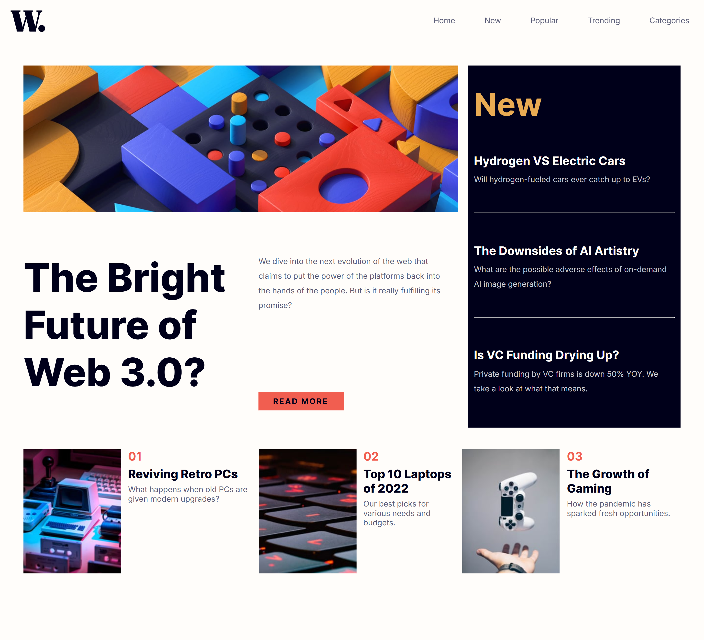

# Frontend Mentor - News homepage solution

This is a solution to the [News homepage challenge on Frontend Mentor](https://www.frontendmentor.io/challenges/news-homepage-H6SWTa1MFl). Frontend Mentor challenges help you improve your coding skills by building realistic projects.

## Table of contents

- [Overview](#overview)
  - [The challenge](#the-challenge)
  - [Screenshot](#screenshot)
  - [Links](#links)
  - [Built with](#built-with)
  - [What I learned](#what-i-learned)
  - [Continued development](#continued-development)
  - [Useful resources](#useful-resources)
- [Author](#author)

**Note: Delete this note and update the table of contents based on what sections you keep.**

## Overview

This news homepage will be an excellent opportunity to practice CSS Grid. There will be lots of tricky decisions to make and plenty of learning opportunities!

### The challenge

Users should be able to:

- View the optimal layout for the interface depending on their device's screen size
- See hover and focus states for all interactive elements on the page

### Screenshot

### Links

- Solution URL: [Add solution URL here](https://github.com/remainhumble/News-homepage)
- Live Site URL: [Add live site URL here](https://remainhumble.github.io/News-homepage/)

### Built with

- Semantic HTML5 markup
- CSS custom properties
- Flexbox
- CSS Grid
- Mobile-first workflow

### What I learned

Throughout this project, I deepened my understanding of responsive web design, particularly using CSS Grid and Flexbox together for complex layouts. I learned how to structure semantic HTML for accessibility and how to use CSS custom properties for easier theme management. Additionally, I improved my workflow by adopting a mobile-first approach.

### Continued development

In future projects, I want to continue focusing on:

- Deepening my understanding of advanced CSS Grid and Flexbox layouts for more complex responsive designs.
- Improving accessibility by learning more about ARIA roles and best practices for inclusive web development.
- Refining my use of CSS custom properties for scalable and maintainable theming.
- Exploring component-based design systems to streamline development and ensure consistency across projects.
- Experimenting with modern CSS features like container queries and logical properties as browser support improves.

### Useful resources

- [WAI-ARIA basics](https://www.frontendmentor.io/learning-paths/introduction-to-web-accessibility-mXu-9PHVsd/article/6647781a20fb35b1b61abb56/read) - This helped me create more accessible and usable websites, ensuring everyone can access and benefit from the content and functionality.
- [The W3C Markup Validation Service](https://validator.w3.org/nu/#textarea) - Copy and paste html code into the 'Validate by direct input' textarea to check for any warnings and errors.
- [Grid by Example](https://gridbyexample.com/examples/) - examples include an image of how the example should look in a supporting browser, they each link to a page with more information about the technique being shown, code and a CodePen of the example. Unless otherwise noted these examples work in any browser supporting the up to date Grid Specification. They will not work in IE10 or 11.

## Author

- Frontend Mentor - [@remainhumble](https://www.frontendmentor.io/profile/remainhumble)
